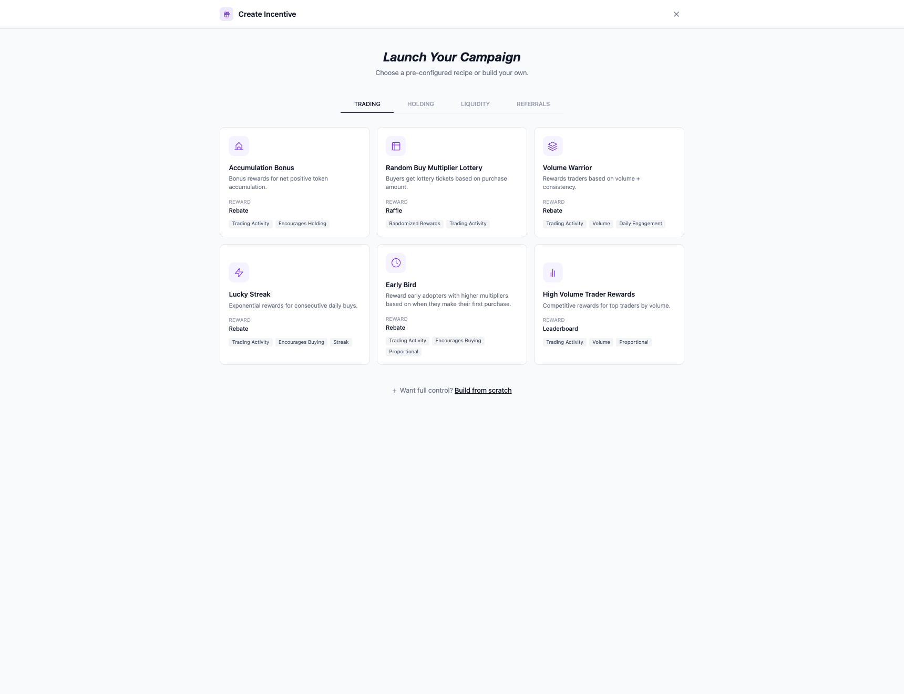
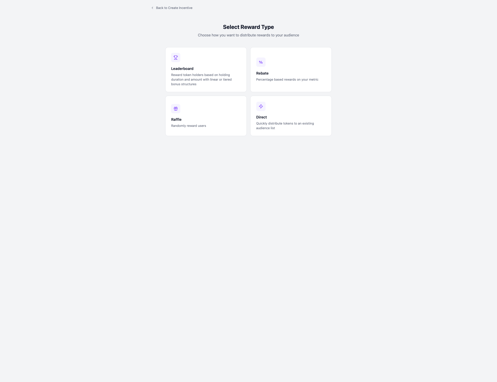
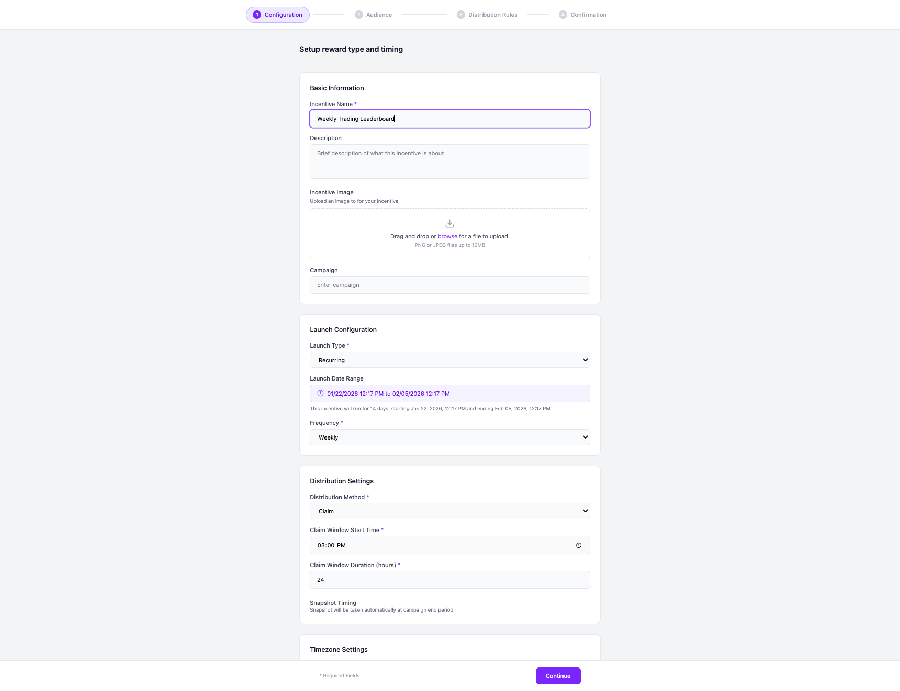
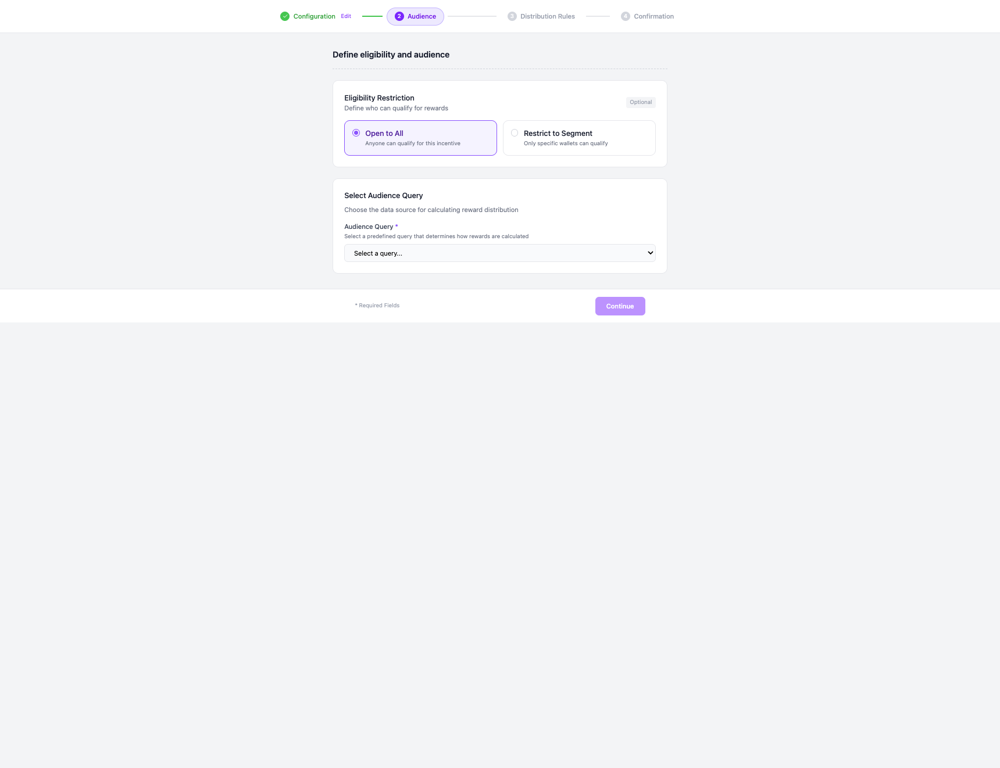
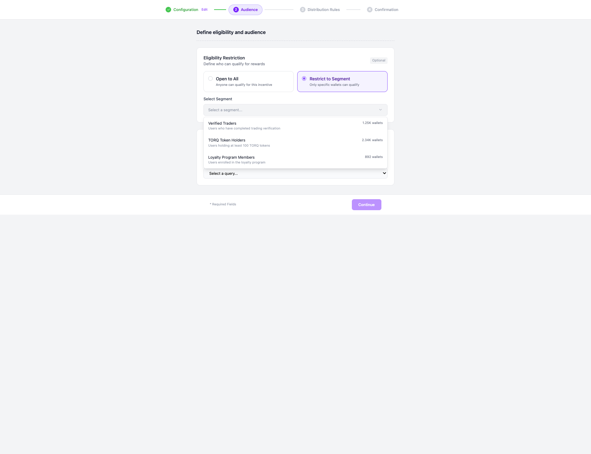
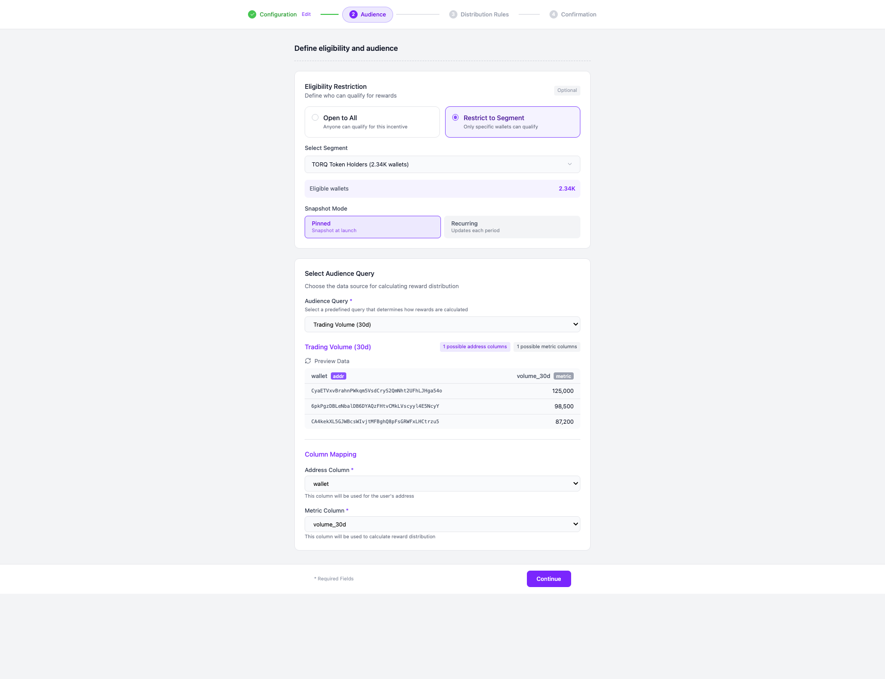
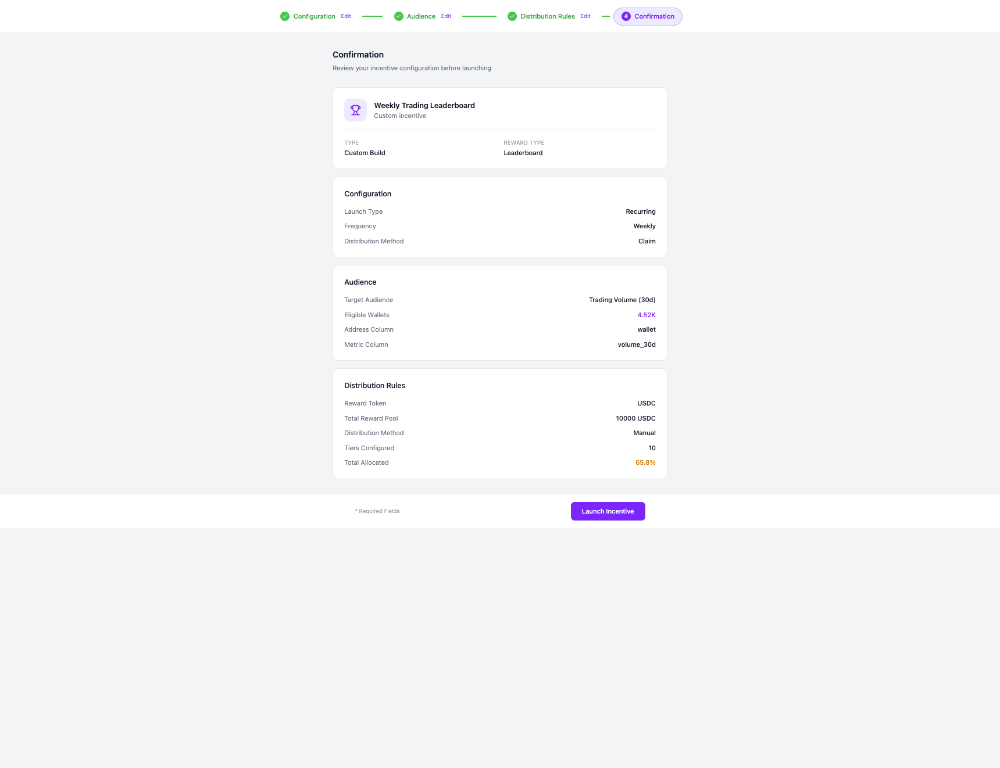

# Build Your Own Incentive Flow

This document describes the "Build Your Own" (BYO) incentive creation flow, which allows users to create custom incentives with full control over eligibility, audience targeting, and reward distribution.

## Overview

The BYO flow consists of:
1. **Reward Type Selection** - Choose from Leaderboard, Rebate, Raffle, or Direct
2. **4-Step Wizard**:
   - Step 1: Configuration
   - Step 2: Audience (Eligibility + Query)
   - Step 3: Distribution Rules
   - Step 4: Confirmation

---

## Entry Point: Create Incentive Modal

Click "New Incentive" in the sidebar to open the Create Incentive modal. At the bottom, click "Build from scratch" to enter the BYO flow.

---

## Reward Type Selection

Choose how you want to distribute rewards:

| Type | Description |
|------|-------------|
| **Leaderboard** | Reward users based on ranking with linear or tiered bonus structures |
| **% Rebate** | Percentage-based rewards on your metric |
| **Raffle** | Randomly reward users |
| **Direct** | Quickly distribute tokens to an existing audience list |

---

## Step 1: Configuration

Configure the basic information and timing for your incentive.

### Sections:
- **Basic Information**: Name, Description, Image, Campaign
- **Launch Configuration**: Launch Type (Recurring/One-time), Date Range, Frequency
- **Distribution Settings**: Method (Claim/Airdrop), Claim Window, Snapshot Timing
- **Timezone Settings**: UTC offset configuration

---

## Step 2: Audience

Define who can qualify for rewards and the data source for calculating distribution.

### Eligibility Restriction (Optional)
Define WHO can qualify for rewards. This is a filter/gate that restricts participation.

| Option | Description |
|--------|-------------|
| **Open to All** | Anyone can qualify for this incentive |
| **Restrict to Segment** | Only specific wallets can qualify |

#### Available Segments:
| Segment | Wallets | Description |
|---------|---------|-------------|
| Verified Traders | 1,247 | Users who have completed trading verification |
| TORQ Token Holders | 2,340 | Users holding at least 100 TORQ tokens |
| Loyalty Program Members | 892 | Users enrolled in the loyalty program |

### Audience Query (Required)
Choose the data source for calculating reward distribution. This determines HOW rewards are calculated.

| Query | Users | Description |
|-------|-------|-------------|
| Trading Volume (30d) | 4,521 | Rank users by their 30-day trading volume |
| PnL Performance | 3,892 | Rank users by their profit and loss |
| Activity Score | 5,678 | Rank users by engagement and activity metrics |

When a query is selected, you can:
- Preview sample data from the query
- Map columns (Address Column, Metric Column)

---

## Step 3: Distribution Rules

Configure how rewards will be distributed.

### Sections:
- **Reward Pool Configuration**: Token (USDC, SOL, USDT, BONK), Total Amount
- **Distribution Configuration**: Quick Presets
- **Distribution Method**: Formula, Manual, CSV
- **Value Type**: By Percentage, Fixed Amount
- **Ordering Mode**: Per Tier, Per Rank
- **Tier Configuration**: Define rank ranges and allocation percentages

---

## Step 4: Confirmation

Review all configuration before launching.

### Summary Includes:
- Incentive name and type
- Configuration settings (Launch Type, Frequency, Distribution Method)
- Audience settings (Target Query, Eligible Wallets, Column Mappings)
- Distribution rules (Token, Pool, Method, Tiers, Total Allocated)

---

## Key Concepts

### Eligibility vs Audience

| Concept | Purpose | Example |
|---------|---------|---------|
| **Eligibility** | Filter WHO can participate | Only TORQ token holders can qualify |
| **Audience Query** | Data source for HOW rewards are calculated | Rank by 30-day trading volume |

### Snapshot Modes (for Eligibility)

| Mode | Description |
|------|-------------|
| **Pinned** | Snapshot taken at campaign launch - eligibility is fixed |
| **Recurring** | Snapshot updates each period - eligibility can change |

---

## Screenshots Reference

| Screenshot | Description |
|------------|-------------|
| `byo-00-create-incentive-modal.png` | Entry point with "Build from scratch" option |
| `byo-01-select-reward-type.png` | Reward type selection (Leaderboard, Rebate, Raffle, Direct) |
| `byo-02-step1-configuration.png` | Step 1: Basic info, timing, distribution settings |
| `byo-03-step2-audience-initial.png` | Step 2: Initial state with eligibility options |
| `byo-04-step2-eligibility-dropdown.png` | Step 2: Eligibility segment dropdown open |
| `byo-05-step2-complete.png` | Step 2: Complete with segment and query selected |
| `byo-06-step3-distribution.png` | Step 3: Distribution rules with tier configuration |
| `byo-07-step4-confirmation.png` | Step 4: Final review before launch |
