# Incentive Creation - UX Documentation

This document describes the user experience flow for creating incentives, including both recipe-based and custom "Build Your Own" flows, with optional segment-based eligibility restrictions.

## Overview

The Incentive Creation feature allows growth/marketing teams to:
- **Use Recipes** - Pre-configured incentive templates for common use cases
- **Build Your Own** - Custom incentives with full control over requirements and rewards
- Launch incentives that are open to all users (default)
- Optionally restrict eligibility to specific wallet segments
- Choose between "pinned" (snapshot at launch) or "recurring" (updates each period) segment membership

## Two Creation Paths

| Path | Best For | Steps |
|------|----------|-------|
| **Recipes** | Quick setup with proven templates | Recipe Selection → Configure → Review |
| **Build Your Own** | Custom requirements and full control | Reward Type → Requirements → Configure → Review |

---

# Part 1: Recipe-Based Flow

## Flow Summary

| Step | Description |
|------|-------------|
| 1 | Click "New Incentive" from sidebar |
| 2 | Select a recipe from the catalog |
| 3 | Configure incentive (name, timing, eligibility) |
| 4 | Review and launch |

---

## Step-by-Step Walkthrough

### 1. Home Screen

The user starts from the main dashboard and clicks the **"New Incentive"** button in the sidebar.


---

### 2. Recipe Selection

A full-screen modal opens showing available incentive recipes organized by category:
- **TRADING** - Volume-based incentives, streaks, etc.
- **HOLDING** - Token holding rewards
- **LIQUIDITY** - LP incentives
- **REFERRALS** - Referral programs

Each recipe card displays:
- Recipe name and description
- Reward type badge (Rebate, Raffle, Leaderboard)
- Category tags

Users can also choose **"Build from scratch"** for full customization.


---

### 3. Configure Step

After selecting a recipe (e.g., "Volume Warrior"), the user enters the configuration step.

#### 3.1 Basic Information
- **Incentive Name** - Pre-filled from recipe, editable
- **Description** - Optional description

#### 3.2 Launch Configuration
- **Launch Type** - Recurring or One-time
- **Duration** - 7, 14, 30, or 90 days
- **Frequency** - Daily, Weekly, or Monthly

#### 3.3 Eligibility (Optional)

The eligibility section allows restricting who can participate:

**Default State - Open to All:**
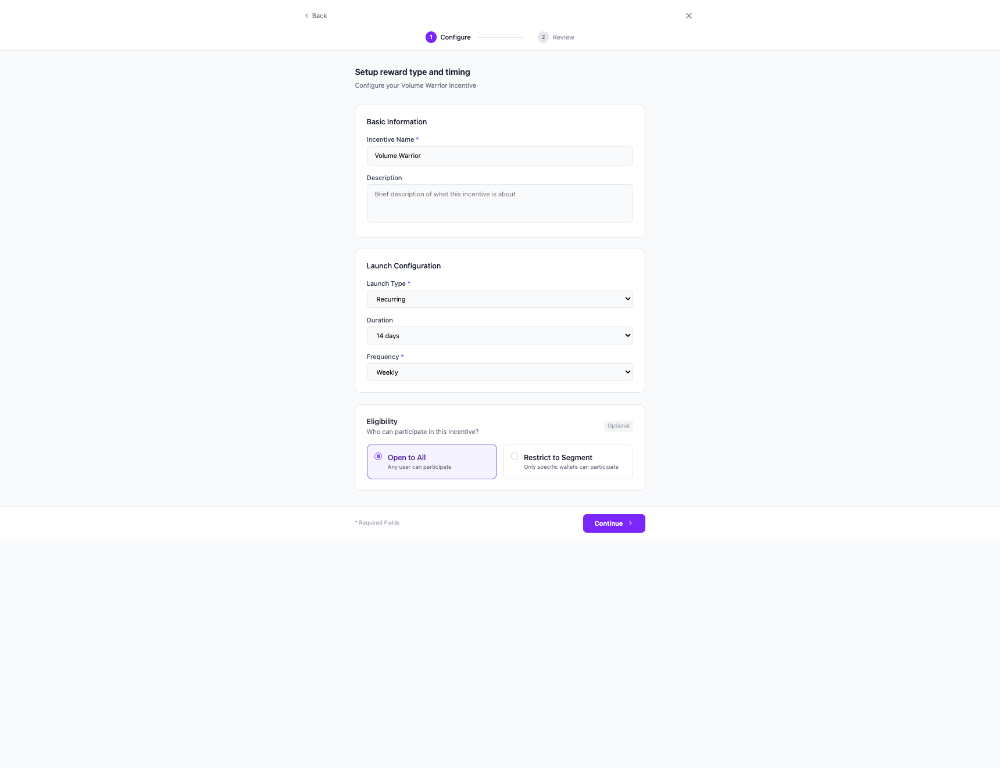

Two options are presented:
- **Open to All** (default selected) - Any user can participate
- **Restrict to Segment** - Only specific wallets can participate

---

### 4. Restricting to a Segment

When the user selects **"Restrict to Segment"**, a dropdown appears to select from available segments.


#### 4.1 Segment Dropdown

Clicking the dropdown reveals all available segments with wallet counts:

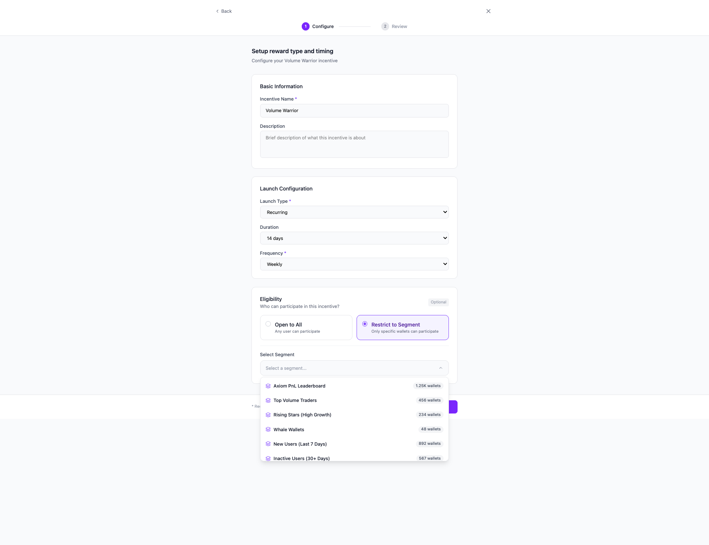

Available segments include:
- Axiom PnL Leaderboard (1.25K wallets)
- Top Volume Traders (456 wallets)
- Rising Stars (234 wallets)
- Whale Wallets (48 wallets)
- New Users (892 wallets)
- Inactive Users (567 wallets)
- Empty Test Segment (0 wallets) - displays warning

---

### 5. Segment Selected with Snapshot Mode

After selecting a segment, the UI shows:
- **Selected segment** with wallet count
- **Eligible wallets** count displayed prominently
- **Snapshot Mode** toggle

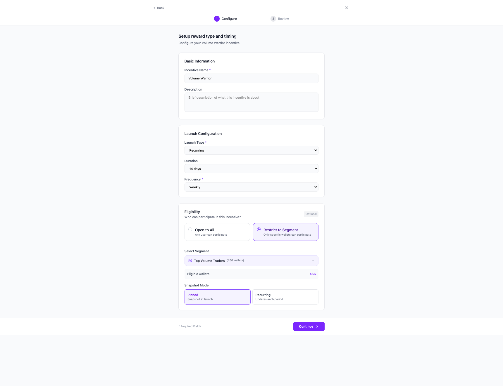

#### Snapshot Modes:

| Mode | Description |
|------|-------------|
| **Pinned** | Snapshot at launch - eligibility is locked when incentive starts |
| **Recurring** | Updates each period - eligibility re-evaluated based on latest segment data |

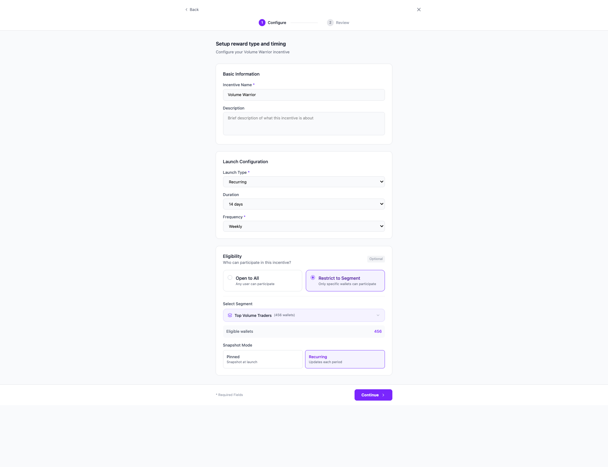

---

### 6. Review Step

The final step displays a summary of all configuration for confirmation:

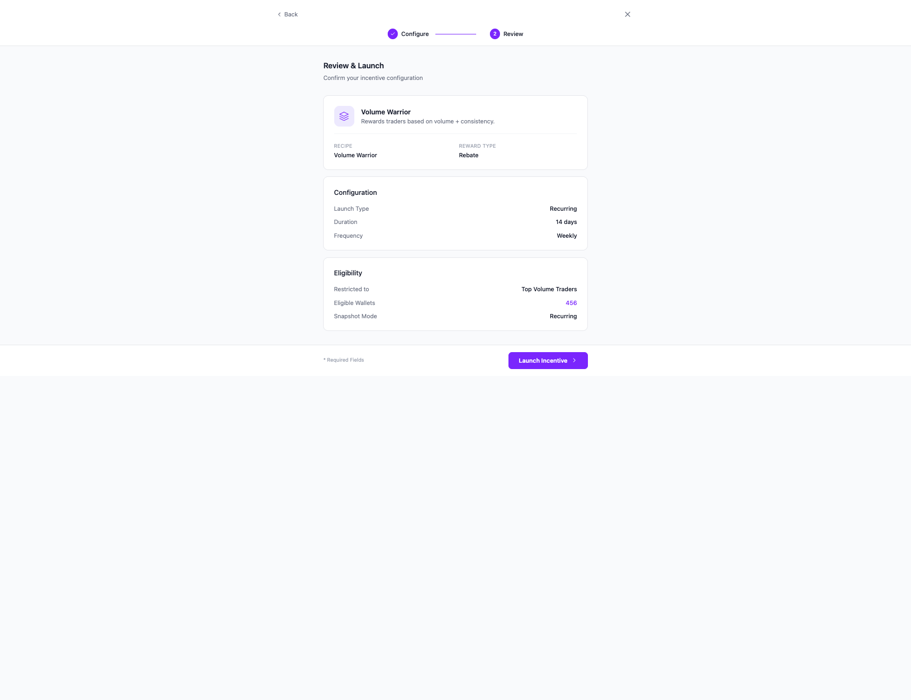

The review shows:
- **Recipe details** - Name, description, reward type
- **Configuration** - Launch type, duration, frequency
- **Eligibility** - Segment restriction, wallet count, snapshot mode

The user can click **"Launch Incentive"** to deploy or **"Back"** to make changes.

---

## Edge Cases

| Scenario | Behavior |
|----------|----------|
| Empty segment (0 wallets) | Warning displayed, user can still proceed |
| Segment deleted after launch | Incentive continues with last known snapshot |
| No segment selected with "Restrict" option | Cannot proceed until segment is selected |

---

## Key UX Decisions

1. **Eligibility is optional** - Default is "Open to All", segment restriction is opt-in
2. **Clear visual distinction** - Radio-button style cards make the choice explicit
3. **Progressive disclosure** - Segment dropdown only appears when "Restrict to Segment" is selected
4. **Immediate feedback** - Wallet count shown as soon as segment is selected
5. **Two-step flow** - Configure → Review keeps the process simple

---

## Technical Notes for Implementation

### State Variables
```javascript
// Eligibility state
audienceType: 'all' | 'segment'  // Which eligibility option is selected
selectedAudience: object | null  // The selected segment object
eligibilityMode: 'pinned' | 'recurring'  // Snapshot mode
```

### Segment Data Structure
```javascript
{
  id: 'top-traders',
  name: 'Top Volume Traders',
  addressColumn: 'wallet',
  metricColumn: 'volume_30d',
  userCount: 456,
  preview: [...] // Sample wallet data
}
```

### API Payload - Recipe (on launch)
```javascript
{
  recipe: 'volume-warrior',
  name: 'Volume Warrior',
  launchType: 'recurring',
  duration: 14,
  frequency: 'weekly',
  eligibility: {
    type: 'segment', // or 'all'
    segmentId: 'top-traders',
    snapshotMode: 'recurring' // or 'pinned'
  }
}
```

---

# Part 2: Build Your Own Flow

The "Build Your Own" flow gives users full control over creating custom incentives with specific requirements and reward structures.

## Flow Summary

| Step | Description |
|------|-------------|
| 1 | Select reward type (Rebate, Raffle, Leaderboard, Airdrop) |
| 2 | Define requirements (actions users must complete) |
| 3 | Configure (name, timing, budget, eligibility) |
| 4 | Review and launch |

---

## Step 1: Choose Reward Type

After clicking **"Build from scratch"** on the recipe selection page, users choose how they want to reward participants.

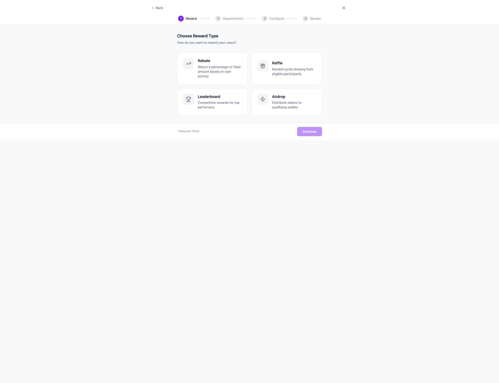

### Available Reward Types:

| Type | Description |
|------|-------------|
| **Rebate** | Return a percentage or fixed amount based on user activity |
| **Raffle** | Random prize drawing from eligible participants |
| **Leaderboard** | Competitive rewards for top performers |
| **Airdrop** | Distribute tokens to qualifying wallets |

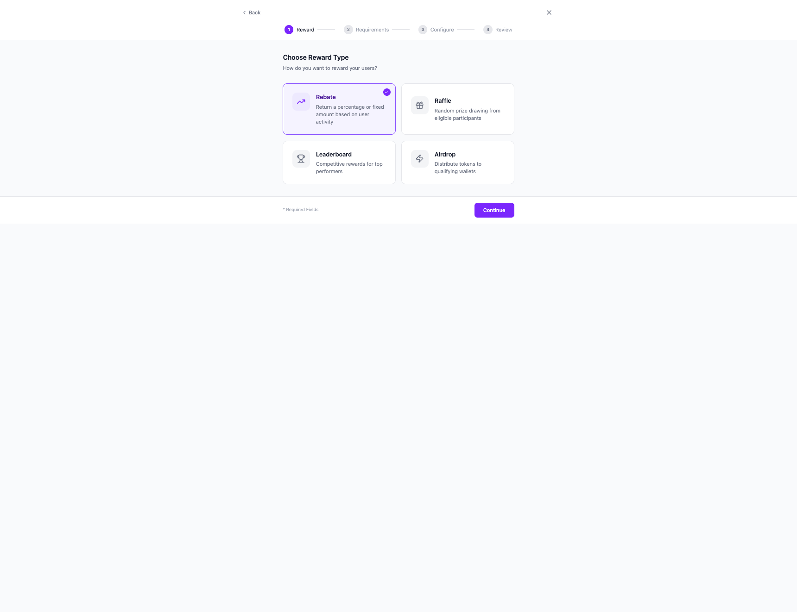

---

## Step 2: Define Requirements

Users specify what actions participants must complete to qualify for rewards.

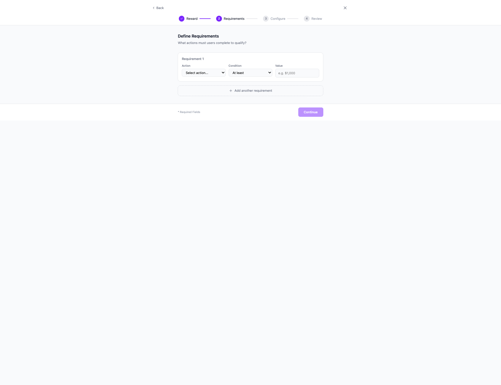

### Requirement Structure:

Each requirement consists of:
- **Action** - What the user must do (Swap, Buy, Sell, Hold, Stake, Provide Liquidity, Refer, Trading Volume)
- **Condition** - Comparison operator (At least, At most, Exactly, More than)
- **Value** - The threshold amount

Users can add multiple requirements using **"Add another requirement"**.

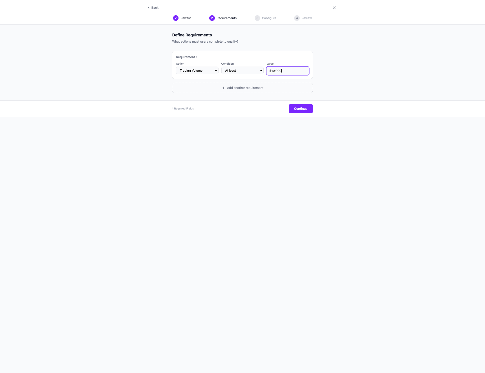

---

## Step 3: Configure

The configuration step includes everything from the recipe flow, plus **Reward Budget** settings.

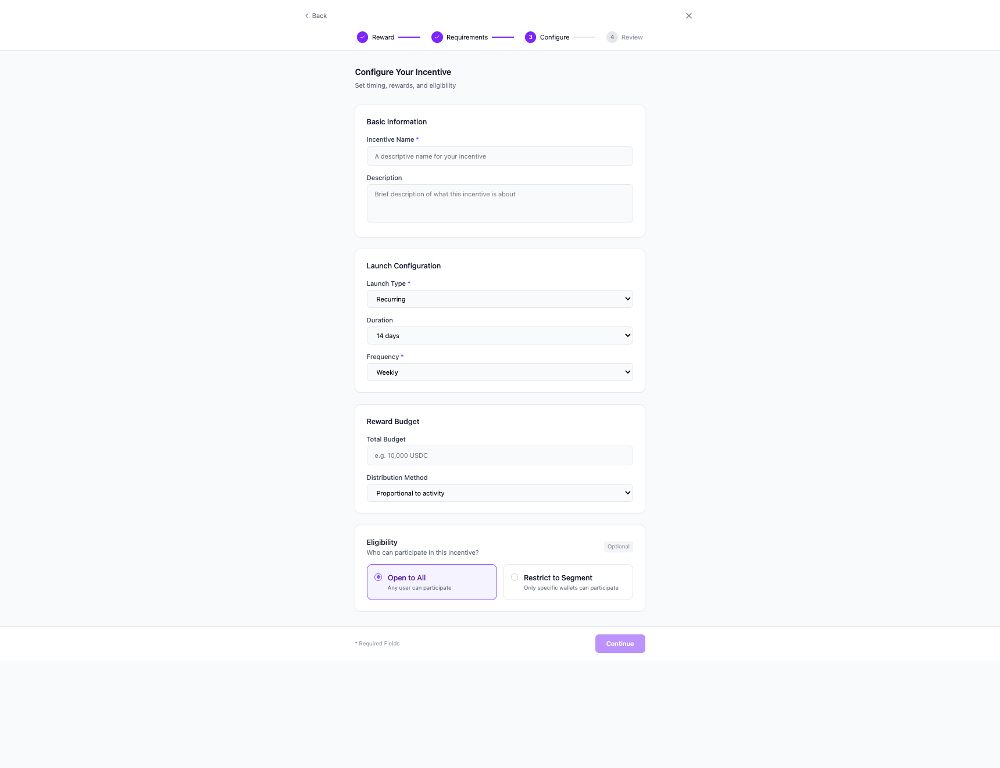

### Configuration Sections:

#### 3.1 Basic Information
- **Incentive Name** - Required
- **Description** - Optional

#### 3.2 Launch Configuration
- **Launch Type** - Recurring or One-time
- **Duration** - 7, 14, 30, or 90 days
- **Frequency** - Daily, Weekly, or Monthly (for recurring)

#### 3.3 Reward Budget (New for Build Your Own)
- **Total Budget** - e.g., "10,000 USDC"
- **Distribution Method**:
  - Proportional to activity
  - Equal split
  - Tiered rewards
  - First come, first served

#### 3.4 Eligibility
Same as recipe flow - "Open to All" or "Restrict to Segment"

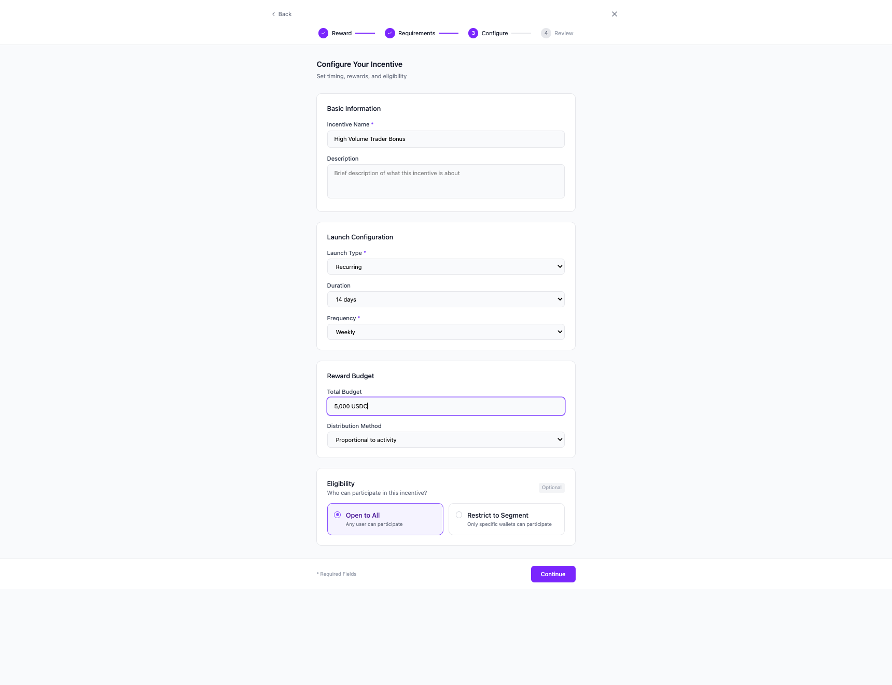

---

## Step 4: Review

The review step shows all custom configuration for confirmation.

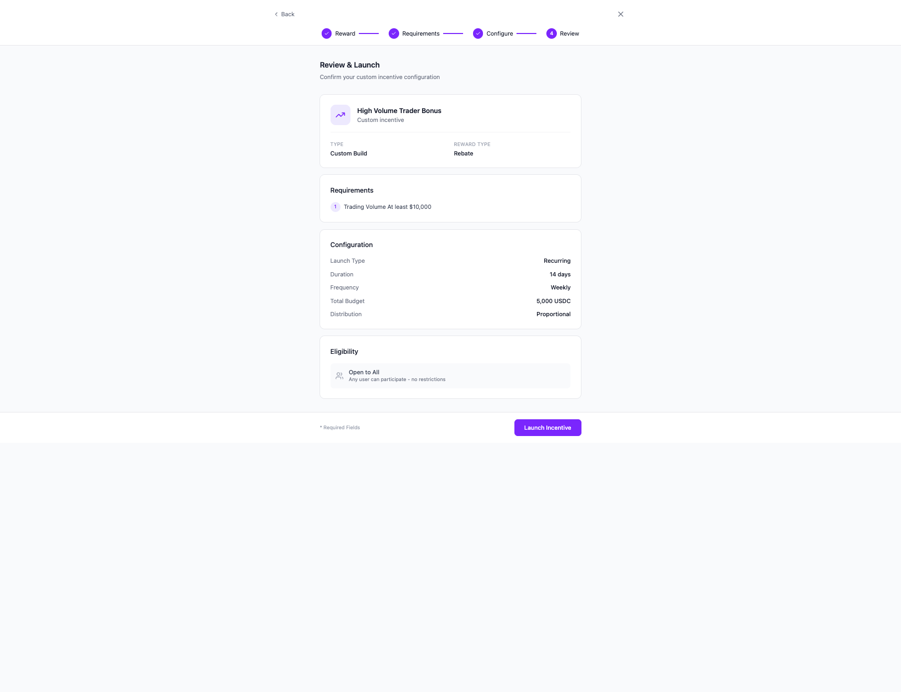

### Review Sections:

- **Incentive Info** - Name, type (Custom Build), reward type
- **Requirements** - All defined requirements with action, condition, and value
- **Configuration** - Launch settings plus budget and distribution
- **Eligibility** - Segment restriction if configured

---

## Technical Notes - Build Your Own

### Additional State Variables
```javascript
// Reward type
selectedRewardType: { id: 'rebate', name: 'Rebate', ... }

// Requirements
requirements: [
  { id: 1, type: 'action', action: 'volume', operator: 'gte', value: '$10,000' }
]

// Reward configuration
rewardConfig: {
  totalBudget: '5,000 USDC',
  distributionMethod: 'proportional' // proportional, equal, tiered, first-come
}
```

### API Payload - Custom (on launch)
```javascript
{
  type: 'custom',
  rewardType: { id: 'rebate', name: 'Rebate' },
  requirements: [
    { action: 'volume', operator: 'gte', value: '$10,000' }
  ],
  name: 'High Volume Trader Bonus',
  description: '',
  launchType: 'recurring',
  duration: 14,
  frequency: 'weekly',
  rewardConfig: {
    totalBudget: '5,000 USDC',
    distributionMethod: 'proportional'
  },
  eligibility: {
    type: 'all'
  }
}
```

### Action Types Reference
```javascript
const actionTypes = [
  { id: 'swap', name: 'Swap' },
  { id: 'buy', name: 'Buy' },
  { id: 'sell', name: 'Sell' },
  { id: 'hold', name: 'Hold' },
  { id: 'stake', name: 'Stake' },
  { id: 'provide-lp', name: 'Provide Liquidity' },
  { id: 'refer', name: 'Refer' },
  { id: 'volume', name: 'Trading Volume' },
];
```
